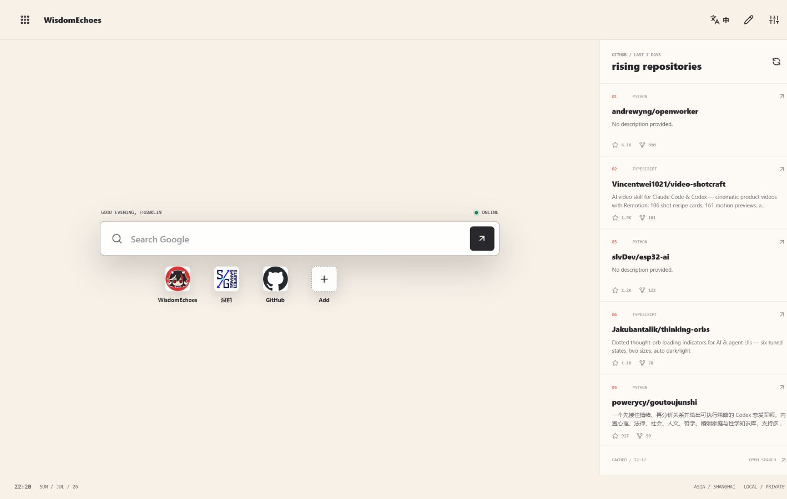

# Wisdom New Tab

一个以 [WisdomEchoes](https://www.wisdomechoes.net/) 为视觉和内容基线的 Chrome / Edge 新标签页插件。它采用真正的浏览器导航页结构：中央 Google 搜索、官方站点 logo 快捷入口、轻量工具栏和实时 GitHub 项目榜单。



## 功能

- 暖白纯色背景，不加载人物主视觉
- 中央 Google 搜索，输入网址时直接打开网址
- `g`、`gh`、`yt`、`mdn`、`npm`、`wiki` 搜索前缀
- WisdomEchoes、浪前和 GitHub 官方 logo 快捷入口
- 快捷入口可新增、编辑、删除、选择颜色，最多 10 个
- 左上角 launcher 集中收纳个人链接、Hacker News、MDN、npm、Ray.so 和 Excalidraw
- `GitHub Rising`：按最近 7 天新建仓库的 star 数排列，显示语言、简介、star 和 fork
- GitHub 数据缓存一小时，离线或限流时继续使用最近一次结果
- 中英文界面切换
- Light / Dark 表面和状态栏设置
- 本地时间、时区和网络状态
- 所有设置只保存在浏览器本地

## 安装

### Chrome

1. 打开 `chrome://extensions`。
2. 打开右上角的「开发者模式」。
3. 点击「加载已解压的扩展程序」。
4. 选择本项目文件夹 `wisdom-newtab`。
5. 新建一个标签页。

### Edge

1. 打开 `edge://extensions`。
2. 打开左侧的「开发人员模式」。
3. 点击「加载解压缩的扩展」。
4. 选择本项目文件夹 `wisdom-newtab`。

修改代码后，在扩展管理页点击插件卡片上的刷新按钮，然后重新打开新标签页。

## 本地预览

插件没有构建步骤。任意静态服务器都可以预览：

```powershell
python -m http.server 4173 --bind 127.0.0.1
```

打开 `http://127.0.0.1:4173/newtab.html`。普通网页预览会自动使用 `localStorage`；作为插件运行时会使用 `chrome.storage.local`。

## 搜索前缀

```text
gh new tab extension   -> GitHub repositories and code
mdn web extensions    -> MDN
npm lucide             -> npm
yt browser extension  -> YouTube
wiki new tab page      -> Wikipedia
```

不加前缀时使用 Google。按 `/` 或 `Ctrl/Cmd + K` 可以聚焦搜索框。

## 项目结构

```text
manifest.json          Manifest V3 配置和新标签页覆盖
newtab.html            页面语义结构
styles.css             全屏导航页视觉和响应式布局
app.js                 搜索、launcher、快捷入口、设置和存储
assets/icons.svg       Lucide 图标精简集合
assets/logos/          WisdomEchoes、浪前和 GitHub 官方 logo
scripts/validate.mjs   零依赖项目校验
```

## 隐私与权限

插件申请 `storage` 权限，并仅对 `https://api.github.com/*` 申请网络访问，用于读取公开仓库搜索结果。它不读取浏览历史、不注入其他网页、不发送分析数据，也不加载远程脚本。搜索内容只会在提交后发送到你选择的搜索目标。

## 发布

首次发布前需要补一套 16、32、48、128 像素图标，并在 `manifest.json` 中声明 `icons`。然后压缩项目内容，在 Chrome Web Store Developer Dashboard 或 Microsoft Edge Add-ons 提交。商店发布需要开发者账号和截图；本地加载不需要。

仓库协作与 GitHub 成就路线见 [GITHUB_PLAYBOOK.md](GITHUB_PLAYBOOK.md)。

## License

[MIT](LICENSE)。图标来自 [Lucide](https://lucide.dev/)，使用 ISC License。
